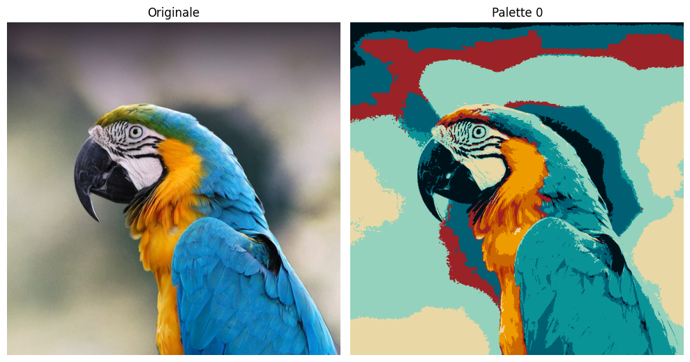

# Image Styling Using K-Nearest Neighbors

This project demonstrates image styling using K-Nearest Neighbors (KNN). The Jupyter notebook contains the implementation and results.

## Project Description

Image styling with K-Nearest Neighbors involves mapping each pixel in the image to the nearest color from a predefined set of colors. This method can be used to apply a specific color palette to an image, effectively "styling" it according to the chosen colors.

## Results

### Styled Image

### Color Palette
I have put some color palettes in the `colors.txt` i have collected from UI websites in txt file, feel free to add your own palettes but do so with the same format or you have to change the way you read the txt file

